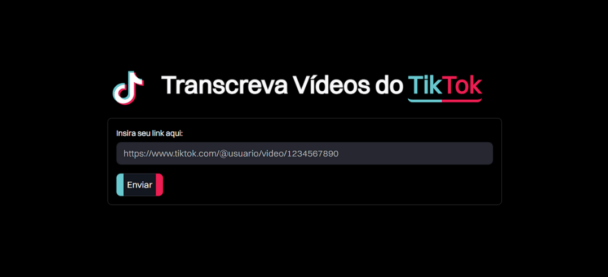

<h1>
  <a href="https://github.com/kaurodri/TikTokTranscriptor">
   </a>
  <span> TikText - Transcreva Vídeos do TikTok!</span>
</h1>

Repositório desenvolvido para apresentar o projeto TikText, uma aplicação construída em **Python** para realizar a transição de vídeos da plataforma digital [TikTok](https://www.tiktok.com/about).

[](https://kauan.dev.br/) 
[](https://kauan.dev.br/)



## Sumário

1. [Tecnologias Utilizadas](#-tecnologias-utilizadas)
2. [Estrutura do Projeto](#-estrutura-do-projeto)
3. [Comandos para Inicialização](#-comandos-para-inicialização)

---

## 📌 Tecnologias Utilizadas

Este projeto foi desenvolvido utilizando as seguintes tecnologias:

##

### 🔹 Linguagem de Programação

- **[Python](https://www.python.org/doc/)**  
  ###### Utilizado como base para toda a lógica do projeto.
  ###### Motivo: Para facilitar a integração do projeto com o Whisper da OpenAI.
##

### 🔹 Frontend

- **[Streamlit](https://docs.streamlit.io/)**  
  ###### Framework para construção da interface web simples, facilitando a interação do usuário com o sistema.

- **[HTML & CSS](https://developer.mozilla.org/pt-BR/docs/Web/CSS)**  
  ###### Utilizados para personalizar e ajustar a aparência da interface criada com Streamlit.

##

### 🔹 Backend

- **[PyYAML](https://pyyaml.org/wiki/PyYAMLDocumentation)**  
  ###### Biblioteca para manipulação de arquivos YAML, utilizada para criar um arquivo de configuração para o yt-dlp.

- **[yt-dlp](https://pypi.org/project/yt-dlp/)**  
  ###### Ferramenta para download de vídeos e áudios de diversas plataformas, empregada aqui para baixar o áudio dos vídeos do TikTok.

- **[openai-whisper](https://openai.com/pt-BR/index/whisper/)**  
  ###### Modelo de transcrição automática de áudio, responsável por converter o áudio baixado em texto.

---

## 📌 Estrutura do Projeto

```
tiktext-estrutura/
├── src/                          # Código-fonte da aplicação.
│   │
│   ├── config/                   # Armazena os arquivos de configuração.
│   │   ├── cookies.txt           # Usados para autenticação do backend.
│   │   └── settings-ytdlp.yaml   # Arquivo de configuração para o yt-dlp.
│   │
│   ├── static/                   # Armazena os arquivos estáticos.
│   │   ├── temp/                 # Pasta para arquivos temporários gerados durante a execução.
│   │   │   └── .gitkeep          # Arquivo para garantir que a pasta seja versionada pelo Git.
│   │   └── index.css             # CSS para a interface do projeto.
│   │
│   ├── utils/                    # Armazena os scripts utilitários e funções auxiliares.
│   │   ├── media_extractor.py    # Script responsável por extrair a mídia.
│   │   └── transcrever.py        # Script responsável pela transcrição da mídia.
│   │
│   └── app.py                    # Arquivo principal da aplicação.
│
├── requirements.txt              # Lista de dependências Python.
├── .gitignore                    # Arquivos/pastas ignorados pelo Git.
├── .python-version               # Especifica a versão do Python usada no projeto.
└── README.md                     # Documentação principal do projeto.
```

---

## 📌 Comandos para Inicialização

> [!IMPORTANT]   
> Para esse projeto funcionar é necessário o uso de cookies. Verifique o arquivo [cookies.txt](./src/config/cookies.txt).

### Padrão

```bash
# Instala todas as dependências.
pip install -r requirements.txt

# Executa a aplicação.
streamlit run src/app.py
```

### Ambiente Virtual (Windows)

```bash
# Cria o ambiente.
python -m venv .venv

# Ativa o ambiente.
source .venv/Scripts/activate

# Instala dentro do ambiente.
pip install -r requirements.txt

# Executa a aplicação.
streamlit run src/app.py
```
